#Project Writeup

##Overview

The objective of this project is to create a convolutional neural network to detect and classify pedestrians, cyclists, and vehicles using data from Waymo. Object detection is a crucial component of self-driving car systems as it allows the vehicle to perceive and understand its surroundings, enabling safe navigation and collision avoidance.

##Dataset

#Exploring Dataset

|	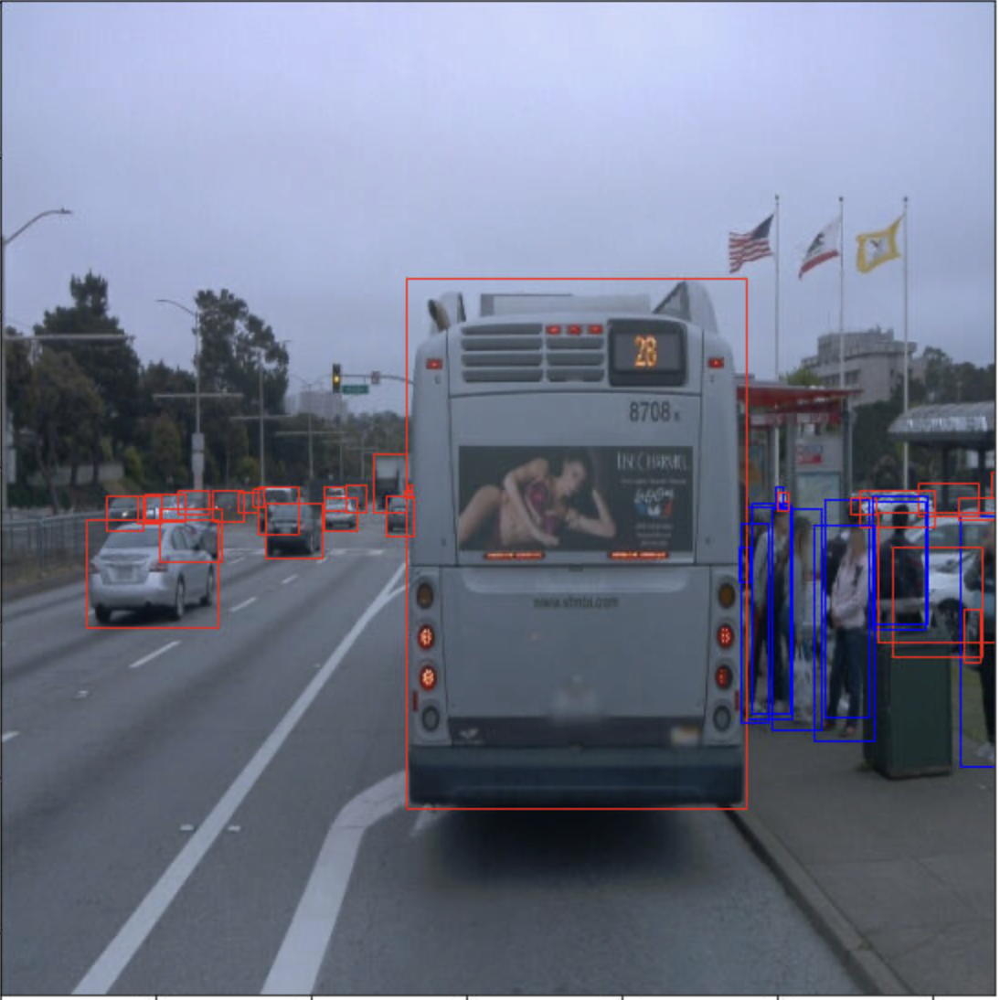	|	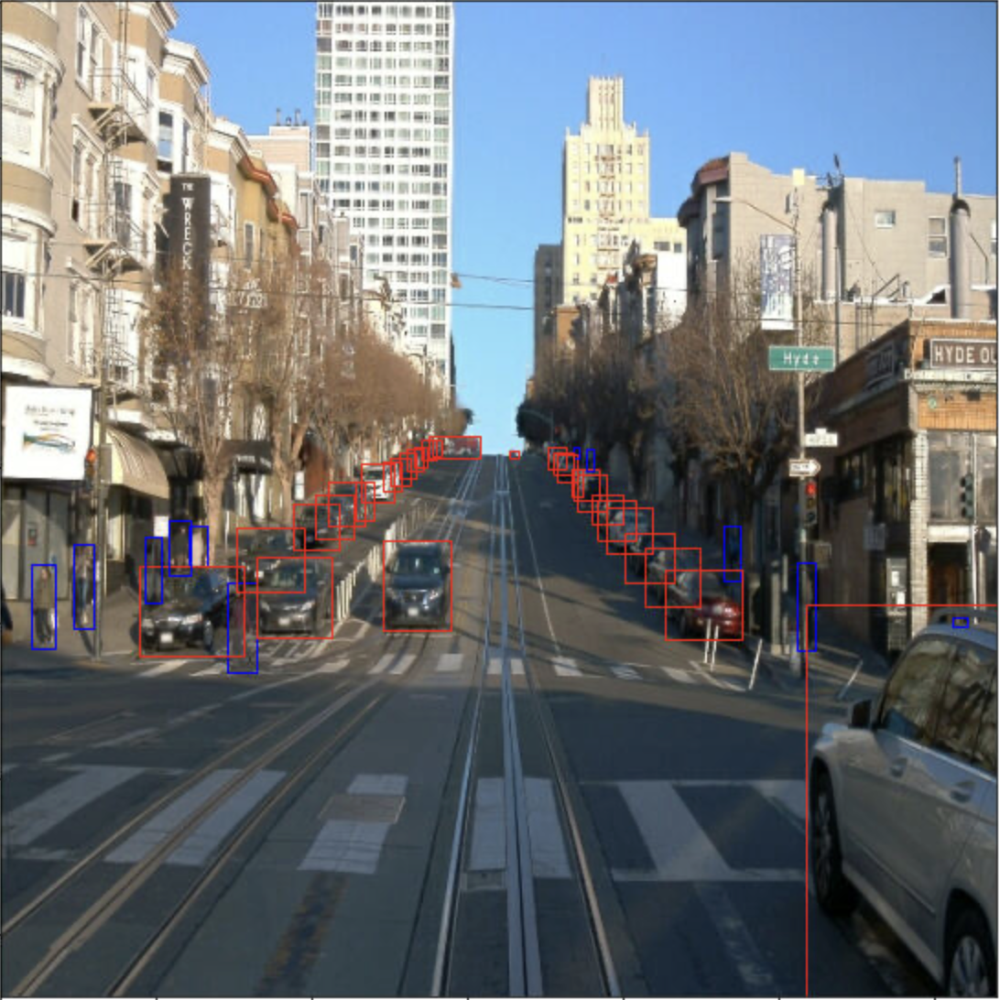	|
|	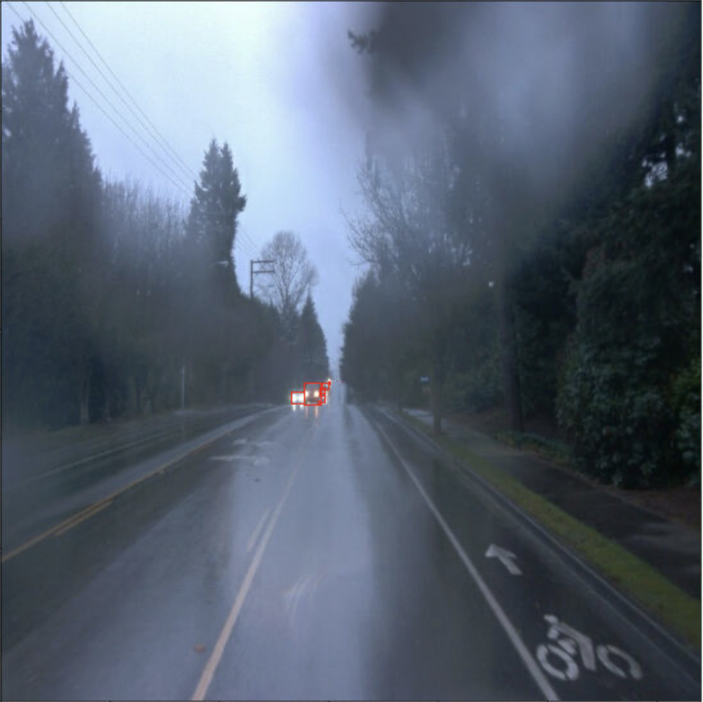	|	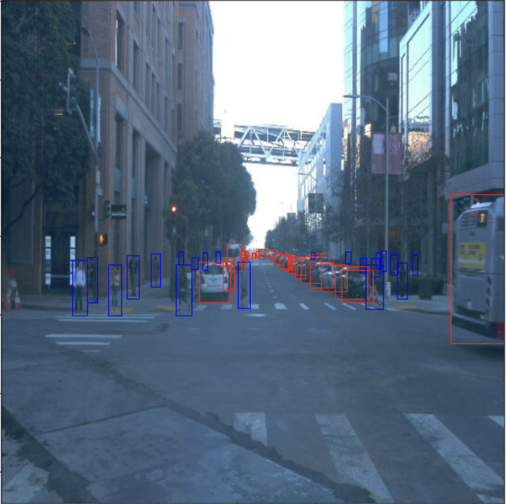	|

#Analysis

From a random sample size of 10k samples we can see the distribution of the different classes and frequency of each class in the samples

Here we can see that the dataset is skewed based on the number of classes in the samples. The dataset is mostly dominated by the class 1 (pedestrians). Class 4 (cyclist) is rarely present in the dataset.

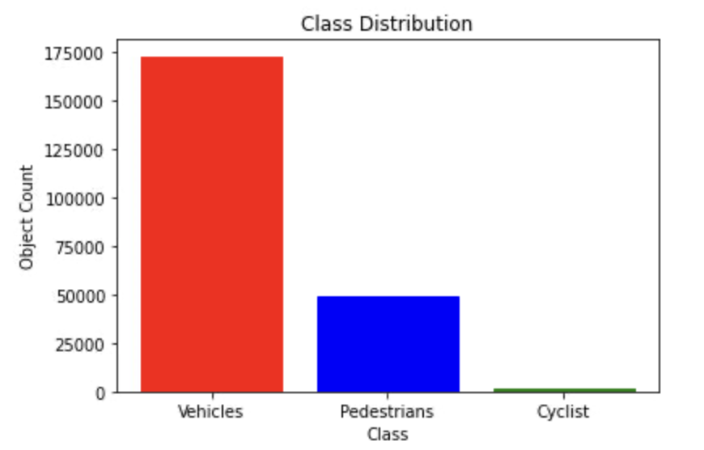

Here we have the frequency of each class that appears in each image/sample.

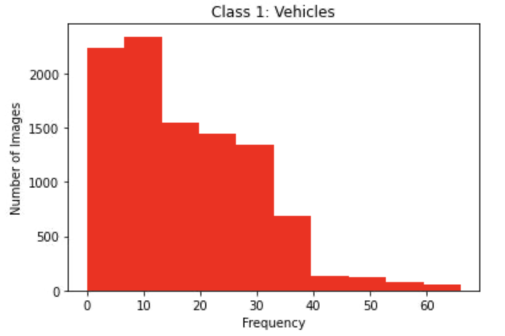
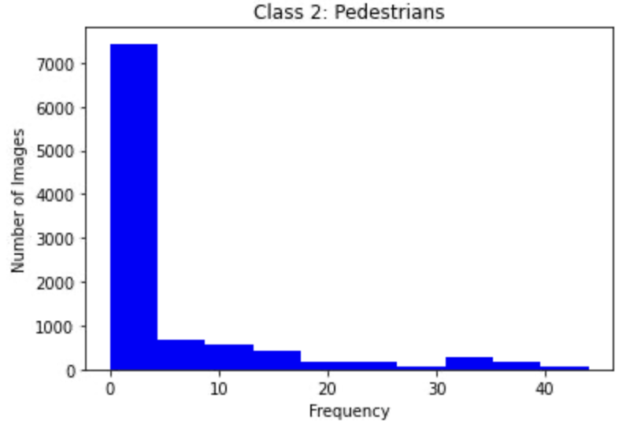
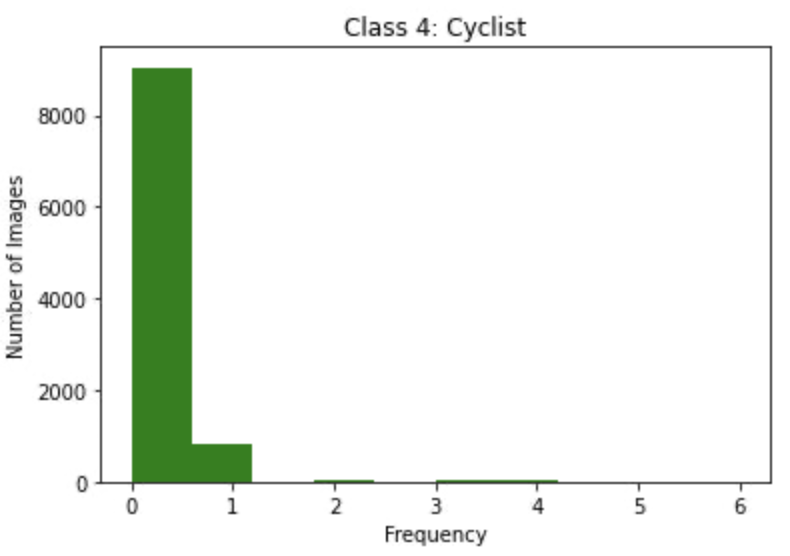

##Training

All training and model parameters are defined in pipeline_new.config located in /home/workspace/experiments/reference folder.
To start a training process run: python experiments/model_main_tf2.py --model_dir=experiments/reference/ --pipeline_config_path=experiments/reference/pipeline_new.config

To start an evaluation process: python experiments/model_main_tf2.py --model_dir=experiments/reference/ --pipeline_config_path=experiments/reference/pipeline_new.config --checkpoint_dir=experiments/reference/

To monitor the process with Tensorboard: python -m tensorboard.main --logdir experiments/reference/

Without augmentations the training metrics after 2500 steps with a learning rate of 0.04

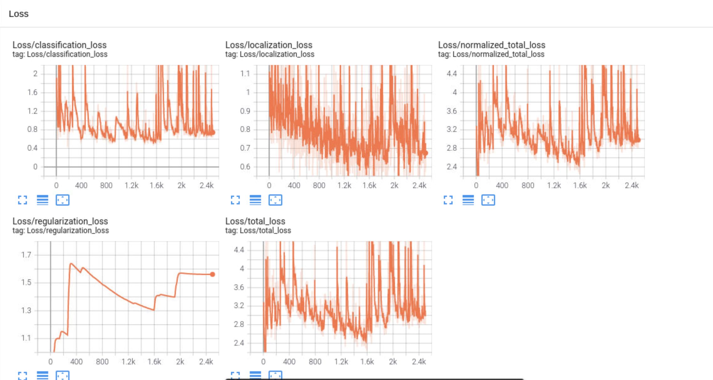

Here we can see that the loss was slowly minimizing but then shot back up. One possible explaination for this could be the high learning rate.

#Evaluation

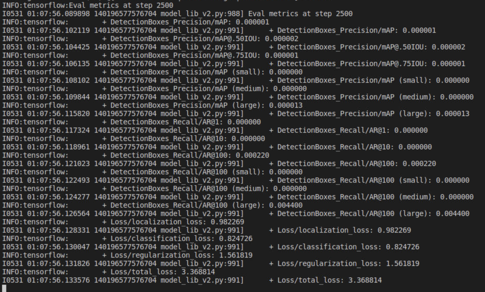

#Augmentation

Allows that model to not overfit and generalize the data more.

random_adjust_brightness - Allows that model to adapt to different lightings such as the brightness of the sun/reflections

random_vertical_flip - Allows to the model to hopefully help detect car accidents where the car is flipped

random_black_patches - Helps if there was anything on the cameras like mud or bugs

random_distort_color - Reflections from different objects can distort the color of detectable objects.

Training

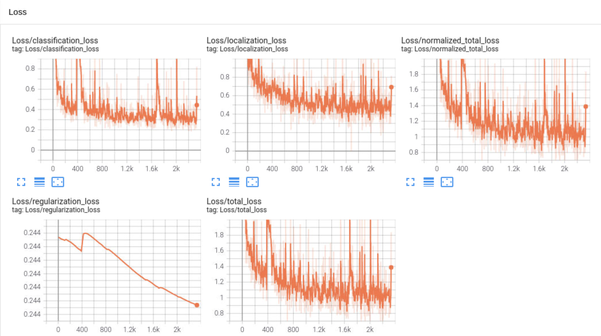

with a learning rate of 0.0001. Here we can see that the loss is slowly constantly minimizing. The model started to plateau around 1.6k steps.

Evaluation

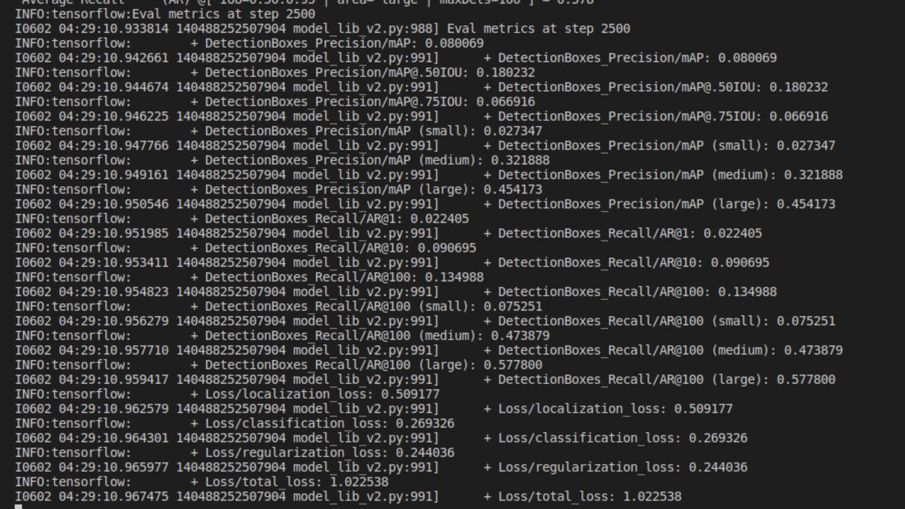

We can see that the loss is lower than the the default model. This could be because of the augmentations or the lower learning rate, due to time constraint it was not testable.

#Test result

